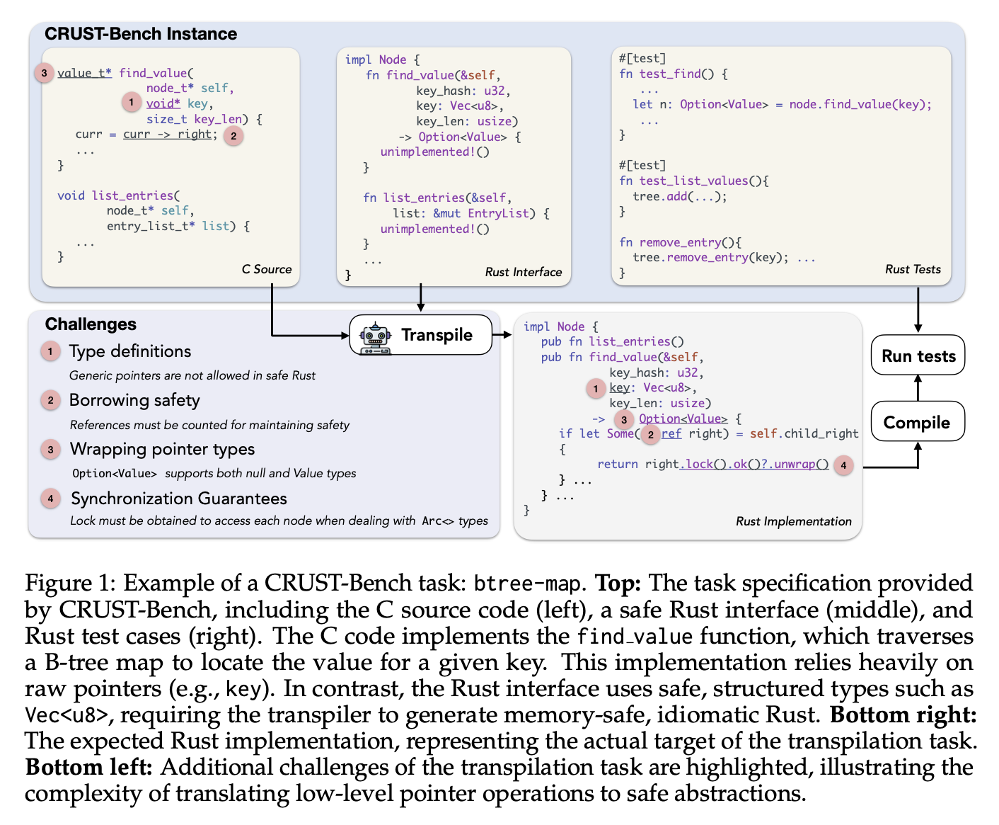

# CRUST-Bench: A Comprehensive Benchmark for C-to-safe-Rust Transpilation

Authors: Anirudh Khatry, Robert Zhang, Jia Pan, Ziteng Wang, Qiaochu Chen, Greg Durrett, Isil Dillig.




## Overview

C-to-Rust transpilation is essential for modernizing legacy C code while enhancing safety and interoperability with modern Rust ecosystems. However, no dataset currently exists for evaluating whether a system can transpile C into safe Rust that passes a set of test cases. We introduce CRUST-Bench, a dataset of 100 C repositories, each paired with manually-written interfaces in safe Rust as well as test cases that can be used to validate correctness of the transpilation. By considering entire repositories rather than isolated functions, CRUST-Bench captures the challenges of translating complex projects with dependencies across multiple files. The provided Rust interfaces provide explicit specifications that ensure adherence to idiomatic, memory-safe Rust patterns, while the accompanying test cases enforce functional correctness. We evaluate state-of-the-art large language models (LLMs) on this task and find that safe and idiomatic Rust generation is still a challenging problem for various state-of-the-art methods and techniques. We also provide insights into the errors LLMs usually make in transpiling code from C to safe Rust. The best performing model, OpenAI o1, is able to solve only 15 tasks in a single-shot setting. Improvements on CRUST-Bench would lead to improved transpilation systems that can reason about complex scenarios and help in migrating legacy codebases from C into languages like Rust that ensure memory safety.

## Paper

Our paper "[Paper Title]" is available at:
- [arXiv](https://arxiv.org/abs/XXXX.XXXXX)

## Dataset Description

### Data Collection
We collected data from 100 Github repositories, spanning various domains like:
 - System utilities
 - Algorithms
 - Programming Language Infrastructure
 - Networking
 - Cryptography and Security
 - Data structures 
 - etc.


### Data Format
The dataset consists of 2 folders namely:
1. CBench
2. Rust Bench

```
CBench/
├── Project_1/
│   ├── file1.c/
│   ├── file2.c/
│   └── ...
├── Project_2/
│   ├── file1.c/
│   ├── file2.c/
│   └── ...
├── Project_3/
│   ├── file1.c/
│   ├── file2.c/
│   └── ...
└── ...

RBench/
├── Project_1/
│   ├── interfaces
│   │   ├── file1.rs
│   │   ├── file2.rs
│   │   └── ...
│   ├── bin
│   │   ├── test1.rs
│   │   ├── test2.rs
│   │   └── ...
├── Project_2/
│   ├── interfaces
│   │   ├── file1.rs
│   │   ├── file2.rs
│   │   └── ...
│   ├── bin
│   │   ├── test1.rs
│   │   ├── test2.rs
│   │   └── ...
│   └── ...
└── ...


```

### Statistics

#### C Code Properties

| **C Code Properties**     | **Avg** | **Max**  |
|--------------------------|--------:|---------:|
| Test cases               |   76.4  |     952  |
| Test files               |    3.0  |      19  |
| Test coverage            |   67%   |    100%  |
| Lines of code            |    958  |  25,436  |
| Pointer dereferences     |    264  |  12,664  |
| Functions                |   34.6  |     418  |

---

#### Interface Metrics

| **Metric**                         | **Total** | **Avg** | **Max** |
|----------------------------------|----------:|--------:|--------:|
| *Interface Structure*            |           |         |         |
| Interface files                  |       299 |     3.0 |     21  |
| Interface functions              |     3,085 |    30.9 |    415  |
| Function arguments               |     5,716 |    57.2 |  1,484  |

| **Ownership and Type Features**                | **Percent** |
|-----------------------------------------------|------------:|
| % Functions with reference args               |        56%  |
| % Custom types in arguments                   |        44%  |
| % Custom types in return types                |        50%  |
| % Functions with mutable references           |        30%  |

## Usage

### Requirements
List any dependencies required to use the dataset:

```bash
pip install -r requirements.txt
```

### Recreating experiments from the CRUST-bench paper
Please set the relevant OpenAI, Antropic, Google AI API keys using the environment variables.

```bash
export OPENAI_API_KEY=<OpenAI_API_KEY>
export ANTHROPIC_API_KEY=<ANTHROPIC_API_KEY>
export GOOGLE_CLOUD_PROJECT=<GOOGLE_CLOUD_PROJECT>
export GOOGLE_CLOUD_REGION=<GOOGLE_CLOUD_REGION>
```


### Loading the Dataset
The `benchmark.py` file contains the function `load_benchmark()` function that takes in the `CBench` and `RustBench` folder paths and enables easy access of CRUST Bench.
Please refer to the `benchmark.py` file for more details. 

## Citation

If you use this dataset in your research, please cite our paper:

```bibtex
@article{author2025dataset,
  title={Dataset Paper Title},
  author={Last, First and Co-author, Second and et al.},
  journal={Journal/Conference Name},
  year={2025},
  volume={XX},
  pages={XXX-XXX},
  doi={10.XXXX/XXXXXXX}
}
```

## License

This dataset is released under [LICENSE NAME] license. See [LICENSE](LICENSE) for details.

## Contact

For questions, issues, or further information, please contact:
- **Name**: [Your Name]
- **Email**: [your.email@institution.edu]
- **GitHub**: [@username](https://github.com/username)

## Acknowledgments

Acknowledge any funding sources, organizations, or individuals who contributed to the creation of this dataset.